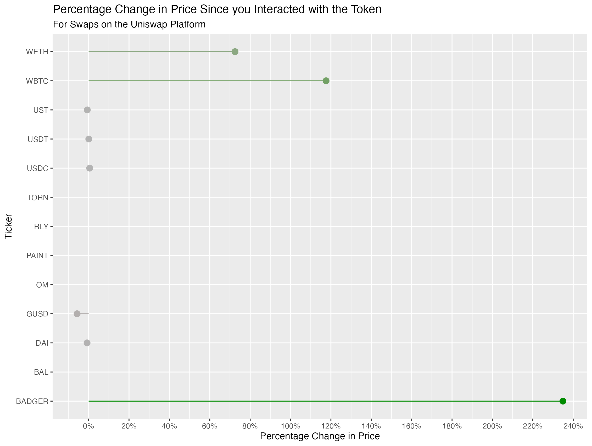

# uniswappeR

R Package for Exploration of Uniswap Positions and Trades

## Description

Our `uniswappeR` R package abstracts away the GraphQL layer of querying for uniswap data into a user-friendly R package. This package a number of high level functions for interacting with this data:

- swaps: Returns the swap data for a given set of addresses
- swap_statistics: High level statistics on swaps
- swap_visualizations: A series of ggplot2 visualizations about swap performance

Install the R package with:

`devtools::install_github("Omni-Analytics-Group/uniswappeR`

## About Us

[Omni Analytics Group](https://omnianalytics.io) is an incorporated group of passionate technologists who help others use data science to change the world. Our  practice of data science leads us into many exciting areas where we enthusiastically apply our machine learning, artificial intelligence and analysis skills. Our flavor for this month, the blockchain!  To learn more about what we do or just to have fun, join us over on [Twitter](https://twitter.com/OmniAnalytics).
