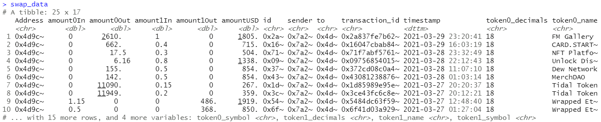
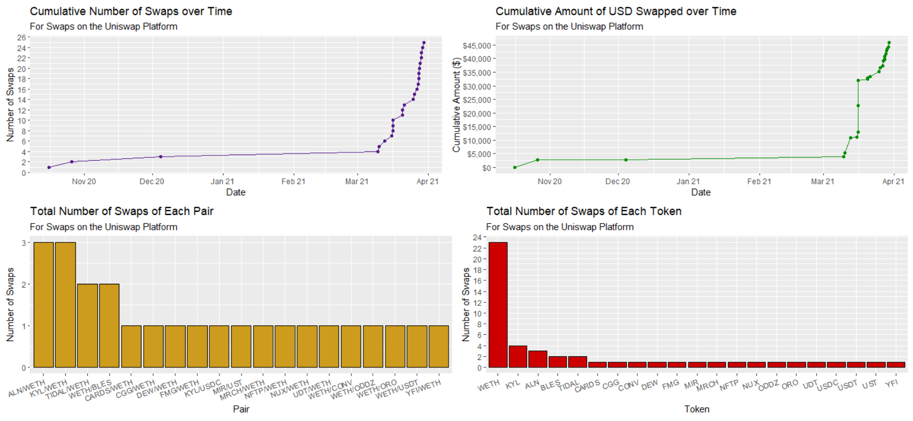

# uniswappeR

R Package to Interact and Trade with Uniswap Platform and Exploration of Uniswap data from GraphQL.

## Trade Functionality

### Description
Our `uniswappeR` R package includes the functionality to trade and query prices from the Uniswap Platform. To interact with the Uniswap Platform
we need to configure the environment and then we can use the functions to make trades on the uniswap platform and query prices.

### Walkthrough

[Video Walkthrough](https://www.youtube.com/watch?v=OJdKNm8W9ik)

#### 0. (Optional Environment Setup) If you want to use the trade functionality of the package.
Note The following steps are not necessary to perform if you only want to interact with the Uniswap data from the GraphQL.
- Install the reticulate package using `library(reticulate)`
- Install python to use as backend using `install_python("3.8.7")`
- Create a Virtual Environment to keep the backend sandboxed using `virtualenv_create("uniswappeR-env", version = "3.8.7")`
- Install uniswap-python package using `virtualenv_install(envname="uniswappeR-env",packages=c("uniswap-python==0.4.6"))`
- Use the Virtual Environment using `use_virtualenv("uniswappeR-env",required=TRUE)`

#### 1. Use the Virtual Environment generated above
- `library(reticulate)`
- `use_virtualenv("uniswappeR-env",required=TRUE)`

#### 2. Use your Infura Node
`set_infura_node("https://mainnet.infura.io/v3/XXXXXXXXXXXXXXXXXXX")`

#### 2. Setup a uniswap session using your address and private key
`u_s <- uniswap_session(
			user_add="******************************************",
			pvt_key="****************************************************************")`

Uniswap Trading Report

## Description

Our `uniswappeR` R package includes the backend to interact with the uniswap platform to make swaps and queries right from your R console. Also contains the codebase to abstracts away the GraphQL layer of querying for uniswap data into a user-friendly R package. This package includes a number of high level functions for interacting with this data:

- swaps: Returns the swap data for a given set of addresses
- swap_statistics: High level statistics on swaps
- swap_visualizations: A series of ggplot2 visualizations about swap performance
- swap_performance: A ggplot2 visualization for assessing the performance of your swaps

## Walkthrough

[Video Walkthrough](https://www.youtube.com/watch?v=OJdKNm8W9ik)

### 0. Install the package.

`devtools::install_github("Omni-Analytics-Group/uniswappeR")`

### 1. Load the package.

- `library(uniswappeR)`

### 2. Define an address or vector of addresses of interest

- `addresses <- c("0x2e3381202988d535e8185e7089f633f7c9998e83", "0x4d9c274ADF71e4201B4aB1f28BF05D44eE4bA261")`

### 3. Get the swap data for those addresses

- `swap_data <- swaps(addresses)`

### 4. Produce visualizations of the swap data

- `swap_visualizations(swap_data)`

### 5. Produce a visualization of the performance of the swaps

- `swap_performance(swap_data)`

## About Us

[Omni Analytics Group](https://omnianalytics.io) is an incorporated group of passionate technologists who help others use data science to change the world. Our  practice of data science leads us into many exciting areas where we enthusiastically apply our machine learning, artificial intelligence and analysis skills. Our flavor for this month, the blockchain!  To learn more about what we do or just to have fun, join us over on [Twitter](https://twitter.com/OmniAnalytics).
