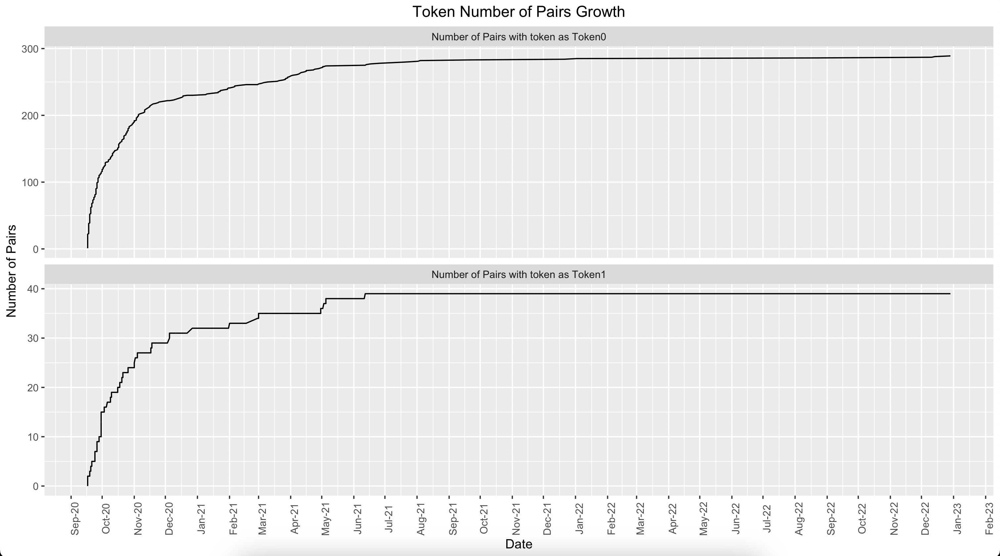
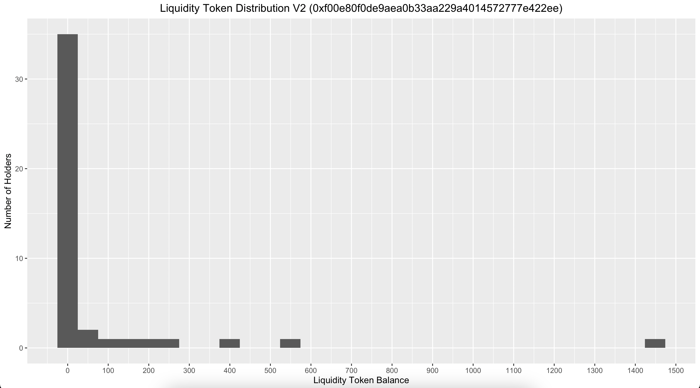

# uniswappeR

R Package to Interact and Trade with Uniswap Platform and Exploration of Uniswap data from GraphQL. 
Install Using  
`devtools::install_github("Omni-Analytics-Group/uniswappeR")`

The package has 3 Functionalities
- [Trade : To query prices and make trades on Uniswap from R console](https://github.com/Omni-Analytics-Group/uniswappeR#trade-functionality)
- [Pull Data : To pull all types of data from Uniswap GraphQL to explore yourself](https://github.com/Omni-Analytics-Group/uniswappeR#pull-data-functionality)
- [Explore Data : To Analyse and explore the uniswap data](https://github.com/Omni-Analytics-Group/uniswappeR#data-exploration-functionality)

## Trade Functionality

### Description
Our `uniswappeR` R package includes the functionality to trade and query prices from the Uniswap Platform. To interact with the Uniswap Platform
we need to configure the environment and then we can use the functions to make trades on the uniswap platform and query prices.

View the [video walkthrough](https://www.youtube.com/watch?v=GpWZLMB2lvM) on how to conduct trades through UniswappeR here.

### Walkthrough

#### 0. (Optional Environment Setup) If you want to use the trade functionality of the package.
- Install the reticulate package using `library(reticulate)`
- Install python to use as backend using `install_python("3.8.7")`
- Create a Virtual Environment to keep the backend sandboxed using `virtualenv_create("uniswappeR-env", version = "3.8.7")`
- Install uniswap-python package using `virtualenv_install(envname="uniswappeR-env",packages=c("uniswap-python==0.4.6"))`
- Use the Virtual Environment using `use_virtualenv("uniswappeR-env",required=TRUE)`
- Extract checksum function from Web3 module `Web3_checksum <- import("web3",convert=FALSE)$Web3$toChecksumAddress`

#### 1. Use the Virtual Environment generated above
- `library(reticulate)`
- `library(uniswappeR)`
- `use_virtualenv("uniswappeR-env",required=TRUE)`

#### 2. Use your Infura Node
`set_infura_node("https://mainnet.infura.io/v3/XXXXXXXXXXXXXXXXXXX")`

#### 3. Setup a uniswap session using your address and private key
`u_w <- uniswap_session(user_add = "**", pvt_key = "***")` 

#### 4. Helper Functions to Check Balances and Query Prices

- We would use Uniswap(UNI)/ETH pair to query on  
	- UNI Token Address 
	`t_a <- Web3_checksum("0x1f9840a85d5af5bf1d1762f925bdaddc4201f984")`
	- UNI Token Decimals 
	`t_d <- 18`

- We would use Uniswap(UNI)/ DAI Stablecoin pair to query for Token to Token swap 
	- UNI Token Address 
	`t1_a <- Web3_checksum("0x1f9840a85d5af5bf1d1762f925bdaddc4201f984")`
	- UNI Token Decimals 
	`t1_d <- 18`
	- DAI Token Address 
	`t2_a <- Web3_checksum("0x6b175474e89094c44da98b954eedeac495271d0f")`
	- DAI Token Decimals 
	`t2_d <- 18`

- Check Your ETH Balance `check_eth_balance(u_w)`

- Check Your Uniswap (UNI) Token Balance 
	- `check_tok_balance(t_a,t_d,u_w)`

- How much UNI Token you would get for .5 ETH, When you Swap ETH for UNI 
	- Ethereum Quantity 
	`e_q <- .5`
	- `check_eth.to.tok_eth.fix(t_a,t_d,e_q,u_w)`

- How much ETH you need to get 2 UNI Tokens, When you Swap ETH for UNI 
	- UNI Tokens Quantity 
	`t_q <- 2`
	- `check_eth.to.tok_tok.fix(t_a,t_d,t_q,u_w)`

- How much ETH you would get for 2 UNI Tokens, When you Swap UNI for ETH 
	- Ethereum Quantity 
	`t_q <- 2`
	- `check_tok.to.eth_tok.fix(t_a,t_d,t_q,u_w)`

- How much UNI Token you need to get .5 ETH Tokens, When you Swap UNI for ETH 
	- Ethereum Quantity 
	`e_q <- .5`
	- `check_tok.to.eth_eth.fix(t_a,t_d,e_q,u_w)`

- How much DAI Token you would get for 2 UNI, When you Swap UNI for DAI (Uses UNI->ETH->DAI Route) 
	- UNI Quantity 
	`t1_q <- 2`
	- `check_tok1.to.tok2_tok1.fix(t1_a,t1_d,t2_a,t2_d,t1_q,u_w)`

- How much UNI Token you would need to get 50 DAI, When you Swap UNI for DAI (Uses UNI->ETH->DAI Route) 
	- UNI Quantity 
	`t2_q <- 50`
	- `check_tok1.to.tok2_tok2.fix(t1_a,t1_d,t2_a,t2_d,t2_q,u_w)`

#### 5. Trade Functions to make swaps on Uniswap

- We would use Uniswap(UNI)/ETH pair to make swaps 
	- UNI Token Address 
	`t_a <- Web3_checksum("0x1f9840a85d5af5bf1d1762f925bdaddc4201f984")`
	- UNI Token Decimals 
	`t_d <- 18`

- We would use Uniswap(UNI)/ DAI Stablecoin pair for Token to Token swap 
	- UNI Token Address 
	`t1_a <- Web3_checksum("0x1f9840a85d5af5bf1d1762f925bdaddc4201f984")`
	- UNI Token Decimals 
	`t1_d <- 18`
	- DAI Token Address 
	`t2_a <- Web3_checksum("0x6b175474e89094c44da98b954eedeac495271d0f")`
	- DAI Token Decimals 
	`t2_d <- 18`

- Swap .5 ETH for UNI Tokens 
	- Ethereum Quantity 
	`e_q <- .5`
	- `trade_eth.to.tok_eth.fix(t_a,t_d,e_q,u_w)`

- Swap as much ETH required to get 2 UNI Tokens 
	- UNI Quantity 
	`t_q <- .5`
	- `trade_eth.to.tok_tok.fix(t_a,t_d,t_q,u_w)`

- Swap 2 UNI Tokens for ETH 
	- UNI Quantity 
	`t_q <- 2`
	- `trade_tok.to.eth_tok.fix(t_a,t_d,t_q,u_w)`

- Swap as much UNI Tokens required to get .5 ETH 
	- Ethereum Quantity 
	`e_q <- .5`
	- `trade_tok.to.eth_eth.fix(t_a,t_d,e_q,u_w)`

- Swap 2 UNI Tokens for DAI Tokens 
	- UNI Quantity 
	`t1_q <- 2`
	- `trade_tok1.to.tok2_tok1.fix(t1_a,t1_d,t2_a,t2_d,t1_q,u_w)`

- Swap as much UNI Tokens required to get 20 DAI Tokens 
	- DAI Quantity 
	`t2_q <- 20`
	- `trade_tok1.to.tok2_tok2.fix(t1_a,t1_d,t2_a,t2_d,t2_q,u_w)`

## Pull Data Functionality

### Description

Our `uniswappeR` R package contains the codebase to abstracts away the GraphQL layer of querying for uniswap data into a user-friendly R package.

View the [video walkthrough](https://www.youtube.com/watch?v=yCDr-zsrM8Y) on how to pull data into R using UniswappeR.

### Walkthrough

#### 1. Load the package.

- `library(uniswappeR)`

#### 2. View Stats or Historical Stats across all pairs generated by Uniswap Factory

- `factory_stats_v2()`
- `uniswap_stats_hist_v2()`

#### 3. View Stats or Historical Stats for a specific token across all pairs that token is included in

- `token_stats_v2(token_address = "0x1f9840a85d5af5bf1d1762f925bdaddc4201f984")`
- `token_stats_hist_v2(token_address = "0x1f9840a85d5af5bf1d1762f925bdaddc4201f984")`

#### 4. For a specific Token get stats for all pairs the Token is either Base or Quote

- `token_pair_map_v2(token_address = "0x1f9840a85d5af5bf1d1762f925bdaddc4201f984")`

#### 5. View Stats or Historical Stats for a specific Pair

- `pair_stats_v2(pair_address = "0xf00e80f0de9aea0b33aa229a4014572777e422ee")`
- `pair_stats_hist_hourly_v2(pair_address = "0xf00e80f0de9aea0b33aa229a4014572777e422ee")`
- `pair_stats_hist_daily_v2(pair_address = "0xf00e80f0de9aea0b33aa229a4014572777e422ee")`

#### 6. View Liquidity Positions or Historical LPs for a specific Pair

- `pair_liq_positions_v2(pair_address = "0xf00e80f0de9aea0b33aa229a4014572777e422ee")`
- `pair_liq_positions_hist_v2(pair_address = "0xf00e80f0de9aea0b33aa229a4014572777e422ee")`

#### 7. Get Mints/Burns/Swaps Txs from a specific Pair

- `pair_mint_txs_v2(pair_address = "0xf00e80f0de9aea0b33aa229a4014572777e422ee")`
- `pair_burn_txs_v2(pair_address = "0xf00e80f0de9aea0b33aa229a4014572777e422ee")`
- `pair_swap_txs_v2(pair_address = "0xf00e80f0de9aea0b33aa229a4014572777e422ee")`

#### 8. View Liquidity Positions or Historical LPs for a specific User

- `user_lps_v2(user_address = "0x2502f65d77ca13f183850b5f9272270454094a08")`
- `user_hist_lps_v2(user_address = "0x2502f65d77ca13f183850b5f9272270454094a08")`

#### 9. Get Mints/Burns/Swaps Txs from a specific User

- `user_swaps_v2(user_address = "0xcd8aa390e6eabbd2169b3580c1f7ce854675fd03")`
- `user_mints_v2(user_address = "0xcd8aa390e6eabbd2169b3580c1f7ce854675fd03")`
- `user_burns_v2(user_address = "0xcd8aa390e6eabbd2169b3580c1f7ce854675fd03")`

#### 10. Export any of the pulled data as CSV file

- `data_to_export <- token_stats_hist_v2(token_address = "0x1f9840a85d5af5bf1d1762f925bdaddc4201f984")`
- `path_to_export <- "~/Desktop/uniswappeR_export.csv"`
- `export_data(data_to_export,path_to_export)`

## Data Exploration Functionality

### Description

Our `uniswappeR` R package includes a number of high level functions for interacting and visualise the data from uniswap:

### Walkthrough

#### 1. Uniswap Platform Growth

- `vis_uniswap_stats_hist_v2()`

Uniswap Platform Growth

#### 2. Token Growth

- `vis_token_stats_hist_v2(token_address = "0x1f9840a85d5af5bf1d1762f925bdaddc4201f984")`

Token Growth

#### 3. Token Number of Pairs Growth

- `vis_token_pair_map_v2(token_address = "0x1f9840a85d5af5bf1d1762f925bdaddc4201f984")`

Token Growth

#### 4. Pair Growth

- `vis_pair_stats_hist_daily_v2(pair_address = "0xf00e80f0de9aea0b33aa229a4014572777e422ee")`

Pair Growth

#### 5. Liquidity Token Distribution

- `vis_pair_liq_positions_v2(pair_address = "0xf00e80f0de9aea0b33aa229a4014572777e422ee")`

Liquidity Token Distribution

#### 6. User Swap Performance

- `addresses <- c("0x2e3381202988d535e8185e7089f633f7c9998e83", "0x4d9c274ADF71e4201B4aB1f28BF05D44eE4bA261")`
- `swap_data <- swaps(addresses)`
- `swap_visualizations(swap_data)`

- `swap_performance(swap_data)`

#### 6. Save analysis plot
- `plot_to_export <- vis_uniswap_stats_hist_v2()`
- `path_to_export <- "~/Desktop/uniswappeR_plot_export.png"`
- `export_plot(plot_to_export,path_to_export)`

## About Us

[Omni Analytics Group](https://omnianalytics.io) is an incorporated group of passionate technologists who help others use data science to change the world. Our  practice of data science leads us into many exciting areas where we enthusiastically apply our machine learning, artificial intelligence and analysis skills. Our flavor for this month, the blockchain!  To learn more about what we do or just to have fun, join us over on [Twitter](https://twitter.com/OmniAnalytics).
