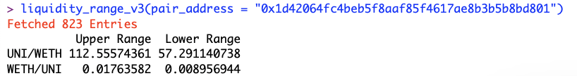
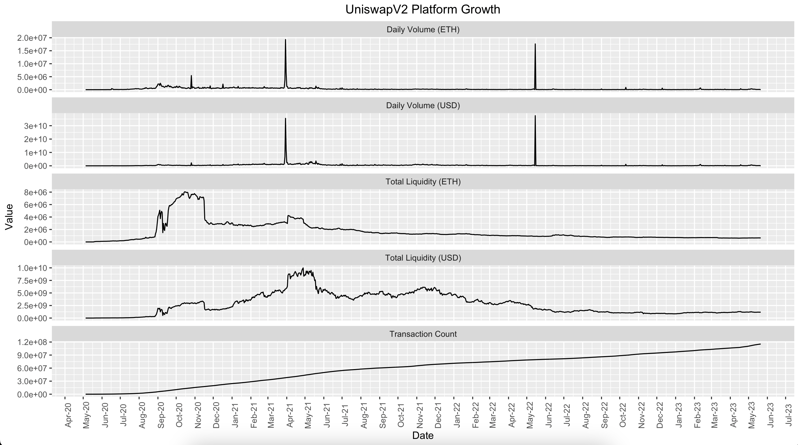
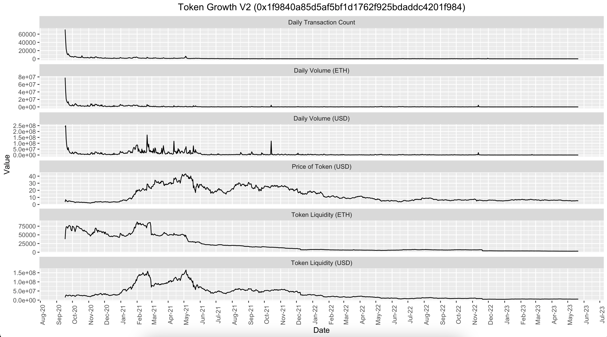
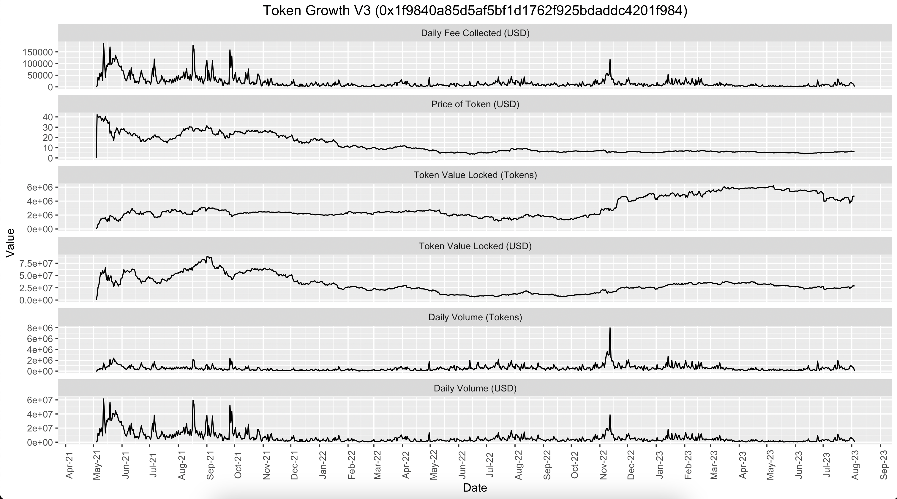
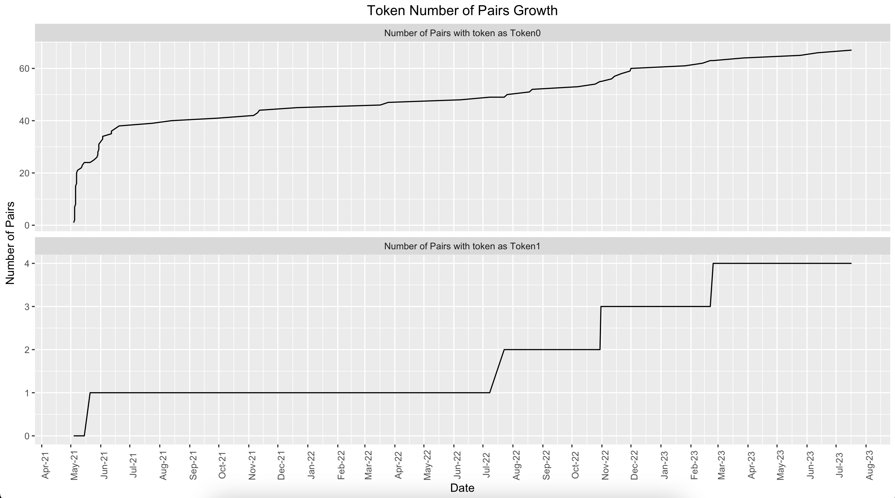
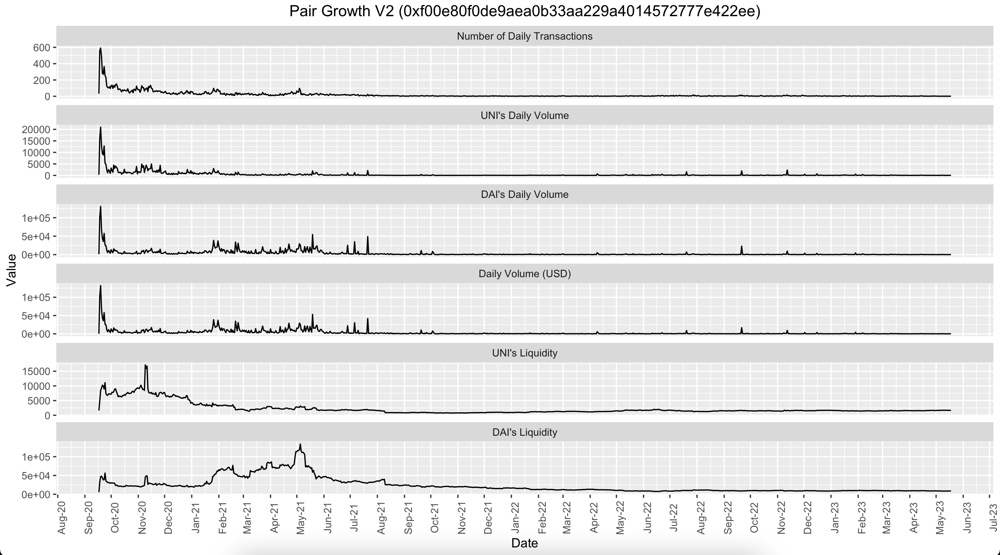
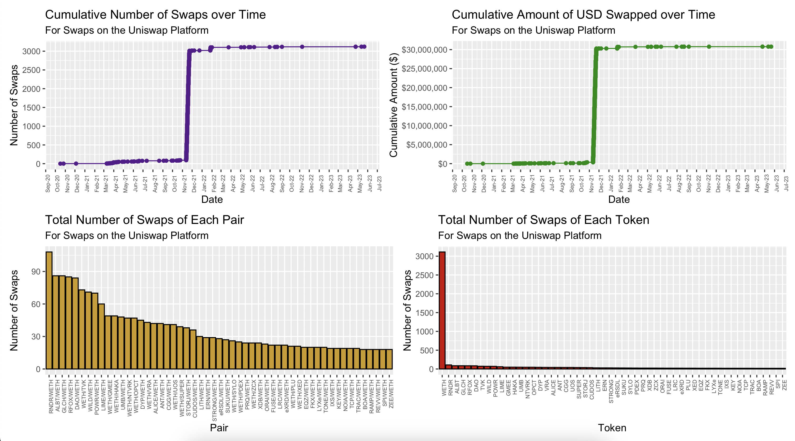

# uniswappeR

R Package to Interact and Trade with Uniswap Platform and Exploration of Uniswap data from GraphQL. 
Install Using  
`devtools::install_github("Omni-Analytics-Group/uniswappeR")`

The package has 3 Functionalities
- [Trade : To query prices and make trades on Uniswap from R console](https://github.com/Omni-Analytics-Group/uniswappeR#trade-functionality)
- [Pull Data : To pull all types of data from Uniswap GraphQL to explore yourself](https://github.com/Omni-Analytics-Group/uniswappeR#pull-data-functionality)
- [Explore Data : To Analyse and explore the uniswap data](https://github.com/Omni-Analytics-Group/uniswappeR#data-exploration-functionality)

## Trade Functionality

### Description
Our `uniswappeR` R package includes the functionality to trade and query prices from the Uniswap Platform. To interact with the Uniswap Platform
we need to configure the environment and then we can use the functions to make trades on the uniswap platform and query prices.

View the [video walkthrough](https://www.youtube.com/watch?v=GpWZLMB2lvM) on how to conduct trades through UniswappeR here.

### Walkthrough

#### 0. (Optional Environment Setup) If you want to use the trade functionality of the package.
- Install the reticulate package using `library(reticulate)`
- Use python3, You can use `py_discover_config()` to figure the path for python3 `use_python("/usr/local/bin/python3")`
- Create a Virtual Environment to keep the backend sandboxed using `virtualenv_create("uniswappeR-env")`
- Install uniswap-python package using `virtualenv_install(envname="uniswappeR-env",packages=c("uniswap-python"))`
- Use the Virtual Environment using `use_virtualenv("uniswappeR-env",required=TRUE)`
- Extract checksum function from Web3 module `Web3_checksum <- import("web3",convert=FALSE)$Web3$toChecksumAddress`

#### 1. Use the Virtual Environment generated above
- `library(reticulate)`
- `library(uniswappeR)`
- `use_virtualenv("uniswappeR-env",required=TRUE)`
- `Web3_checksum <- import("web3",convert=FALSE)$Web3$toChecksumAddress`

#### 2. Use your Infura Node
`set_infura_node("https://mainnet.infura.io/v3/XXXXXXXXXXXXXXXXXXX")`

#### 3. Setup a uniswap session using your address and private key. Choose UniswapV2 or UniswapV3 by supplying the version as 2 or 3 respectively.
`u_w <- uniswap_session(user_add = "**", pvt_key = "***", version = 3)` 

#### 4. Helper Functions to Check Balances and Query Prices

- We would use Uniswap(UNI)/ETH pair to query on  
	- UNI Token Address 
	`t_a <- Web3_checksum("0x1f9840a85d5af5bf1d1762f925bdaddc4201f984")`
	- UNI Token Decimals 
	`t_d <- 18`

- We would use Uniswap(UNI)/ DAI Stablecoin pair to query for Token to Token swap 
	- UNI Token Address 
	`t1_a <- Web3_checksum("0x1f9840a85d5af5bf1d1762f925bdaddc4201f984")`
	- UNI Token Decimals 
	`t1_d <- 18`
	- DAI Token Address 
	`t2_a <- Web3_checksum("0x6b175474e89094c44da98b954eedeac495271d0f")`
	- DAI Token Decimals 
	`t2_d <- 18`

- Check Your ETH Balance 
	- `check_eth_balance(u_w)`
	

- Check Your Uniswap (UNI) Token Balance 
	- `check_tok_balance(t_a,t_d,u_w)`

- How much UNI Token you would get for .5 ETH, When you Swap ETH for UNI 
	- Ethereum Quantity 
	`e_q <- .5`
	- `check_eth.to.tok_eth.fix(t_a,t_d,e_q,u_w)`

- How much ETH you need to get 2 UNI Tokens, When you Swap ETH for UNI 
	- UNI Tokens Quantity 
	`t_q <- 2`
	- `check_eth.to.tok_tok.fix(t_a,t_d,t_q,u_w)`

- How much ETH you would get for 2 UNI Tokens, When you Swap UNI for ETH 
	- Ethereum Quantity 
	`t_q <- 2`
	- `check_tok.to.eth_tok.fix(t_a,t_d,t_q,u_w)`

- How much UNI Token you need to get .5 ETH Tokens, When you Swap UNI for ETH 
	- Ethereum Quantity 
	`e_q <- .5`
	- `check_tok.to.eth_eth.fix(t_a,t_d,e_q,u_w)`

- How much DAI Token you would get for 2 UNI, When you Swap UNI for DAI (Uses UNI->ETH->DAI Route) 
	- UNI Quantity 
	`t1_q <- 2`
	- `check_tok1.to.tok2_tok1.fix(t1_a,t1_d,t2_a,t2_d,t1_q,u_w)`

- How much UNI Token you would need to get 50 DAI, When you Swap UNI for DAI (Uses UNI->ETH->DAI Route) 
	- UNI Quantity 
	`t2_q <- 50`
	- `check_tok1.to.tok2_tok2.fix(t1_a,t1_d,t2_a,t2_d,t2_q,u_w)`

#### 5. Trade Functions to make swaps on Uniswap

- We would use Uniswap(UNI)/ETH pair to make swaps 
	- UNI Token Address 
	`t_a <- Web3_checksum("0x1f9840a85d5af5bf1d1762f925bdaddc4201f984")`
	- UNI Token Decimals 
	`t_d <- 18`

- We would use Uniswap(UNI)/ DAI Stablecoin pair for Token to Token swap 
	- UNI Token Address 
	`t1_a <- Web3_checksum("0x1f9840a85d5af5bf1d1762f925bdaddc4201f984")`
	- UNI Token Decimals 
	`t1_d <- 18`
	- DAI Token Address 
	`t2_a <- Web3_checksum("0x6b175474e89094c44da98b954eedeac495271d0f")`
	- DAI Token Decimals 
	`t2_d <- 18`

- Swap .5 ETH for UNI Tokens 
	- Ethereum Quantity 
	`e_q <- .5`
	- `trade_eth.to.tok_eth.fix(t_a,t_d,e_q,u_w)`

- Swap as much ETH required to get 2 UNI Tokens 
	- UNI Quantity 
	`t_q <- .5`
	- `trade_eth.to.tok_tok.fix(t_a,t_d,t_q,u_w)`

- Swap 2 UNI Tokens for ETH 
	- UNI Quantity 
	`t_q <- 2`
	- `trade_tok.to.eth_tok.fix(t_a,t_d,t_q,u_w)`

- Swap as much UNI Tokens required to get .5 ETH 
	- Ethereum Quantity 
	`e_q <- .5`
	- `trade_tok.to.eth_eth.fix(t_a,t_d,e_q,u_w)`

- Swap 2 UNI Tokens for DAI Tokens 
	- UNI Quantity 
	`t1_q <- 2`
	- `trade_tok1.to.tok2_tok1.fix(t1_a,t1_d,t2_a,t2_d,t1_q,u_w)`

- Swap as much UNI Tokens required to get 20 DAI Tokens 
	- DAI Quantity 
	`t2_q <- 20`
	- `trade_tok1.to.tok2_tok2.fix(t1_a,t1_d,t2_a,t2_d,t2_q,u_w)`

## Pull Data Functionality

### Description

Our `uniswappeR` R package contains the codebase that abstracts away the GraphQL layer of querying for uniswap data into a user-friendly R package.

View the [video walkthrough](https://www.youtube.com/watch?v=yCDr-zsrM8Y) on how to pull data into R using UniswappeR.

### Walkthrough

#### 1. Load the package.

- `library(uniswappeR)`

#### 2. View Stats or Historical Stats across all pairs generated by Uniswap Factory

- `factory_stats_v2()`
- `factory_stats_v3()`
- `uniswap_stats_hist_v2()`
- `uniswap_stats_hist_v3()`

#### 3. View Stats or Historical Stats for a specific token across all pairs that token is included in

- `token_stats_v2(token_address = "0x1f9840a85d5af5bf1d1762f925bdaddc4201f984")`
- `token_stats_v3(token_address = "0x1f9840a85d5af5bf1d1762f925bdaddc4201f984")`
- `token_stats_hist_v2(token_address = "0x1f9840a85d5af5bf1d1762f925bdaddc4201f984")`
- `token_stats_hist_v3(token_address = "0x1f9840a85d5af5bf1d1762f925bdaddc4201f984")`

#### 4. For a specific Token get stats for all pairs the Token is either Base or Quote

- `token_pair_map_v2(token_address = "0x1f9840a85d5af5bf1d1762f925bdaddc4201f984")`
- `token_pair_map_v3(token_address = "0x1f9840a85d5af5bf1d1762f925bdaddc4201f984")`

#### 5. Fetch All Pairs deployed

- `pairs_all_v2()`
- `pairs_all_v3()`

#### 6. View Stats or Historical Stats for a specific Pair

- `pair_stats_v2(pair_address = "0xf00e80f0de9aea0b33aa229a4014572777e422ee")`
- `pair_stats_v3(pair_address = "0x1d42064fc4beb5f8aaf85f4617ae8b3b5b8bd801")`
- `pair_stats_hist_hourly_v2(pair_address = "0xf00e80f0de9aea0b33aa229a4014572777e422ee")`
- `pair_stats_hist_hourly_v3(pair_address = "0x1d42064fc4beb5f8aaf85f4617ae8b3b5b8bd801")`
- `pair_stats_hist_daily_v2(pair_address = "0xf00e80f0de9aea0b33aa229a4014572777e422ee")`
- `pair_stats_hist_daily_v3(pair_address = "0x1d42064fc4beb5f8aaf85f4617ae8b3b5b8bd801")`

#### 7. View Liquidity Positions or Historical LPs for a specific Pair

- `pair_liq_positions_v2(pair_address = "0xf00e80f0de9aea0b33aa229a4014572777e422ee")`
- `pair_liq_positions_v3(pair_address = "0x1d42064fc4beb5f8aaf85f4617ae8b3b5b8bd801")`
- `pair_liq_positions_hist_v2(pair_address = "0xf00e80f0de9aea0b33aa229a4014572777e422ee")`
- `pair_liq_positions_hist_v3(pair_address = "0x1d42064fc4beb5f8aaf85f4617ae8b3b5b8bd801")`

#### 8. Get Mints/Burns/Swaps Txs from a specific Pair

- `pair_mint_txs_v2(pair_address = "0xf00e80f0de9aea0b33aa229a4014572777e422ee")`
- `pair_mint_txs_v3(pair_address = "0x1d42064fc4beb5f8aaf85f4617ae8b3b5b8bd801")`
- `pair_burn_txs_v2(pair_address = "0xf00e80f0de9aea0b33aa229a4014572777e422ee")`
- `pair_burn_txs_v3(pair_address = "0x1d42064fc4beb5f8aaf85f4617ae8b3b5b8bd801")`
- `pair_swap_txs_v2(pair_address = "0xf00e80f0de9aea0b33aa229a4014572777e422ee")`
- `pair_swap_txs_v3(pair_address = "0x1d42064fc4beb5f8aaf85f4617ae8b3b5b8bd801")`

#### 9. View Liquidity Positions or Historical LPs for a specific User

- `user_lps_v2(user_address = "0x2502f65d77ca13f183850b5f9272270454094a08")`
- `user_lps_v3(user_address = "0xF1c206dd83ee2b8E6Ea675Cf827C93c58486B972")`
- `user_hist_lps_v2(user_address = "0x2502f65d77ca13f183850b5f9272270454094a08")`
- `user_hist_lps_v3(user_address = "0xF1c206dd83ee2b8E6Ea675Cf827C93c58486B972")`

#### 10. Get Mints/Burns/Swaps Txs from a specific User

- `user_swaps_v2(user_address = "0xcd8aa390e6eabbd2169b3580c1f7ce854675fd03")`
- `user_swaps_v3(user_address = "0x431B5A84aCC1297Eda88259f300262F1bc3A74f3")`
- `user_mints_v2(user_address = "0xcd8aa390e6eabbd2169b3580c1f7ce854675fd03")`
- `user_mints_v3(user_address = "0x431B5A84aCC1297Eda88259f300262F1bc3A74f3")`
- `user_burns_v2(user_address = "0xcd8aa390e6eabbd2169b3580c1f7ce854675fd03")`
- `user_burns_v3(user_address = "0x431B5A84aCC1297Eda88259f300262F1bc3A74f3")`

#### 11. Export any of the pulled data as CSV file

- `data_to_export <- token_stats_hist_v2(token_address = "0x1f9840a85d5af5bf1d1762f925bdaddc4201f984")`
- `path_to_export <- "~/Desktop/uniswappeR_export.csv"`
- `export_data(data_to_export,path_to_export)`

## Data Exploration Functionality

### Description

Our `uniswappeR` R package includes a number of high level functions for interacting and visualising the data from uniswap:

### Walkthrough

#### 1. UniswapV3 Pair Token Liquidity Range Forecast.

The below code snippet provides a forecast using geometric Brownian motion its tunable parameters are the Pair's Address, forecast window, max % increase that can occur in a single day, and number of simulations, respectively. The resulting output is a data frame with the liquidity  range forecast.

- `liquidity_range_all_v3(pair_address = "0x1d42064fc4beb5f8aaf85f4617ae8b3b5b8bd801",days=30,cap=10,sims=1000)`

UniswapV3 Pair Liquidity Range Forecast

This provides the suggested range for the liquidity.
- `liquidity_range_v3(pair_address = "0x1d42064fc4beb5f8aaf85f4617ae8b3b5b8bd801")`

UniswapV3 Pair Liquidity Range

#### 2. Liquidity Range Estimates Visualisation

Allows for the visualisation of the GBM process for a Pair's address. Additionally `ggplot` pipelines can be added to modify the visualisation.

- `liquidity_range_visualization("0x1d42064fc4beb5f8aaf85f4617ae8b3b5b8bd801")`

#### 3. Uniswap Platform Growth

This section introduces various visualisations within `uniswappeR`.

This allows the user to visualise various growth metrics of the UniswapV2 Platform. From this, insights about daily volume, liquidity, and transaction counts can be analyzed. For example, we can infer that the amount of transactions overtime is steadily increasing, and that there is not a clear, discernible pattern for the daily volume nor liquidity.

- `vis_uniswap_stats_hist_v2()`

Uniswap Platform Growth

This allows the user to visualise various growth metrics of the UniswapV3 Platform. From this, insights about daily volume, liquidity, and transaction counts can be analyzed. This visual quickly allows us to see that sometime around March 2022, a large spike occured for the daily volume. This this enables the curious user to explore in further detail the events that occurred that day.

- `vis_uniswap_stats_hist_v3()`

Uniswap Platform Growth

#### 4. Token Growth

This allows the user to visualise various growth metrics of a given token in UniswapV2. Similar to the other historical stats functions, this allows the user to see past trends for a specific token on UniswapV2. From this we can quickly notice a downward trend in token liquidity signaling a rush on that token.

- `vis_token_stats_hist_v2(token_address = "0x1f9840a85d5af5bf1d1762f925bdaddc4201f984")`

Token Growth

This allows the user to visualise various growth metrics of a given token in UniswapV3. Similar to the other historical stats functions, this allows the user to see past trends for a specific token on UniswapV3. One quick insight we can gather is that there appears to be a progressively less popularity in this token's trade volume which is allow, perhaps, correlating with the token's price.

- `vis_token_stats_hist_v3(token_address = "0x1f9840a85d5af5bf1d1762f925bdaddc4201f984")`

Token Growth

#### 5. Token Number of Pairs Growth

The below visual provides an indication of how often a given token is in a pair where token0 and token1 are given by the sorting order.

- `vis_token_pair_map_v2(token_address = "0x1f9840a85d5af5bf1d1762f925bdaddc4201f984")`

Token Growth

The below visual provides an indication of how often a given token is in a pair where token0 and token1 are given by the sorting order.

- `vis_token_pair_map_v3(token_address = "0x1f9840a85d5af5bf1d1762f925bdaddc4201f984")`

Token Growth

#### 6. Pair Growth

The following provides a vasual of various growth metrics of a given pair in UniswapV2. In this example the pair_address is UNI to DAI.

- `vis_pair_stats_hist_daily_v2(pair_address = "0xf00e80f0de9aea0b33aa229a4014572777e422ee")`

Pair Growth

The following provides a vasual of various growth metrics of a given pair in UniswapV3.

- `vis_pair_stats_hist_daily_v3(pair_address = "0x1d42064fc4beb5f8aaf85f4617ae8b3b5b8bd801")`

Pair Growth

#### 7. Liquidity Token Distribution

Allows for a user to visualise liquidity positions spread in a given pair via a histogram. One insight we can gather from this is that one address is providing about 1450 tokens to the LP whereas most others are contributing substaintially less.

- `vis_pair_liq_positions_v2(pair_address = "0xf00e80f0de9aea0b33aa229a4014572777e422ee")`

Liquidity Token Distribution

#### 8. User Swap Performance

Allows a user to retrieve all the swaps data for a given address or addresses. This allows a user to readily recognize their level of activity.

- `addresses <- c("0x2e3381202988d535e8185e7089f633f7c9998e83", "0x4d9c274ADF71e4201B4aB1f28BF05D44eE4bA261")`
- `swap_data <- swaps(addresses)`
- `swap_visualizations(swap_data)`

- `swap_performance(swap_data)`

#### 9. Save analysis plot

- `plot_to_export <- vis_uniswap_stats_hist_v2()`
- `path_to_export <- "~/Desktop/uniswappeR_plot_export.png"`
- `export_plot(plot_to_export,path_to_export)`

## Significant Updates

#### 5/14/2022
- Added UniswapV3 data pull support for pending 'Liquidity Positions'

#### 3/9/2022
- Added UniswapV3 data pull support for all stats, except 'Liquidity Positions'
- Added trading functionality for V3
- Updated the ReadMe to reflect the most recent changes

## About Us

[Omni Analytics Group](https://omnianalytics.io) is an incorporated group of passionate technologists who help others use data science to change the world. Our  practice of data science leads us into many exciting areas where we enthusiastically apply our machine learning, artificial intelligence and analysis skills. Our flavor for this month, the blockchain!  To learn more about what we do or just to have fun, join us over on [Twitter](https://twitter.com/OmniAnalytics).
